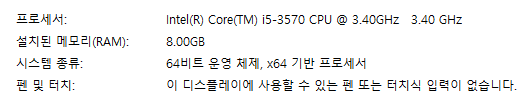

# TODO
# END
- [x] [object keys](./object/keys.js) **2018-02-01**
- [x] [object values](./object/values.js) **2018-02-01**
- [x] [async function](./async/index.js) **2018-02-01**
- [x] [for](./for/index.js) **2018-01-31**
- [x] [file order](./file-order/index.js) **2018-01-30**
- [x] [try catch return](./try-catch/index.js) **2018-01-30**
- [x] [require object](./require-object/index.js) **2018-01-29**
- [x] [compare two object](./compare/object.js) **2017-01-26**
## 2017-09-13
[promise](./promise)
## 2017-08-24
[require](./mysqlpool)
## 2017-08-06
### Computer Spec
 
[require](./mysql)
## 2017-08-05
### Computer Spec
 
[require](./require)
