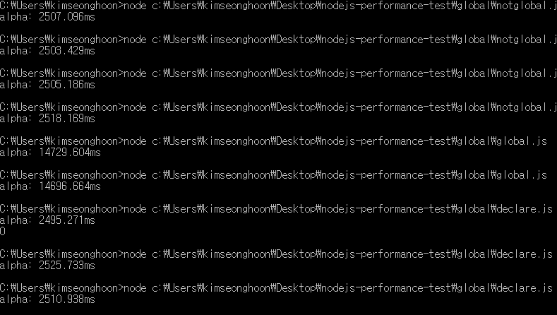

# 2017-08-06
global 변수 관련 perforemace 비교 

## Average
전역 변수 사용 vs 글로벌 변수 사용 vs 글로벌 변수를 전역 변수로 사용
2508.47ms VS 14713.134ms VS 2510.647333333333ms 
글로벌 변수를 사용할일이 있으면 사용하는데, 전역 변수로 선언해놓고 사용 해야겠다. 
## Source Code
[global.js](global.js) 
[declare.js](declare.js) 
[notglobal.js](notglobal.js)