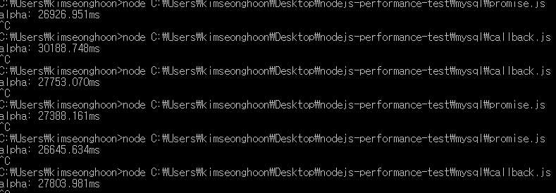

# 2017-08-06
promise를 사용했을때와 안했을 때를 비교 

## Average
프로미즈 사용 vs 사용안함 
26986.91533333333ms VS 28581.933ms 
둘이 비슷한거같다. 
나중에 더 여러 가지의 test case로 test 해봐야 할듯
## Source Code
[callback.js](callback.js) 
[promise.js](promise.js)