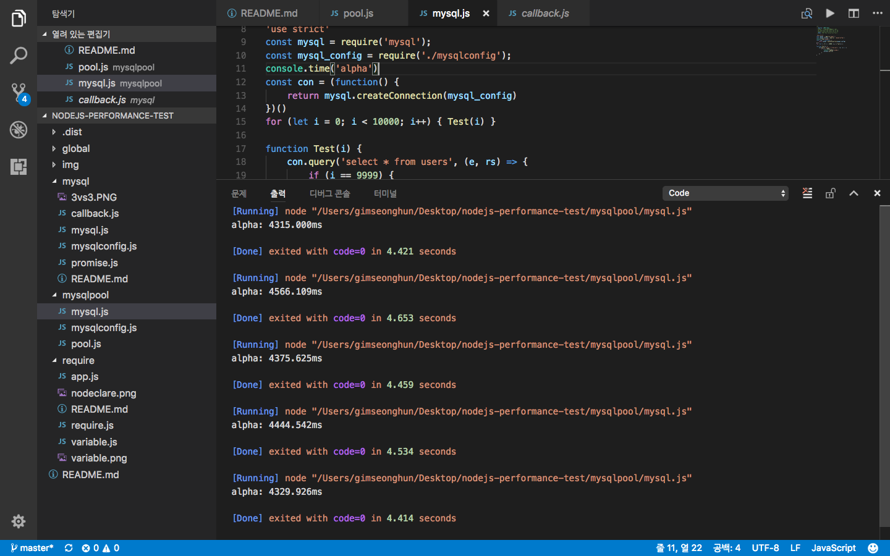
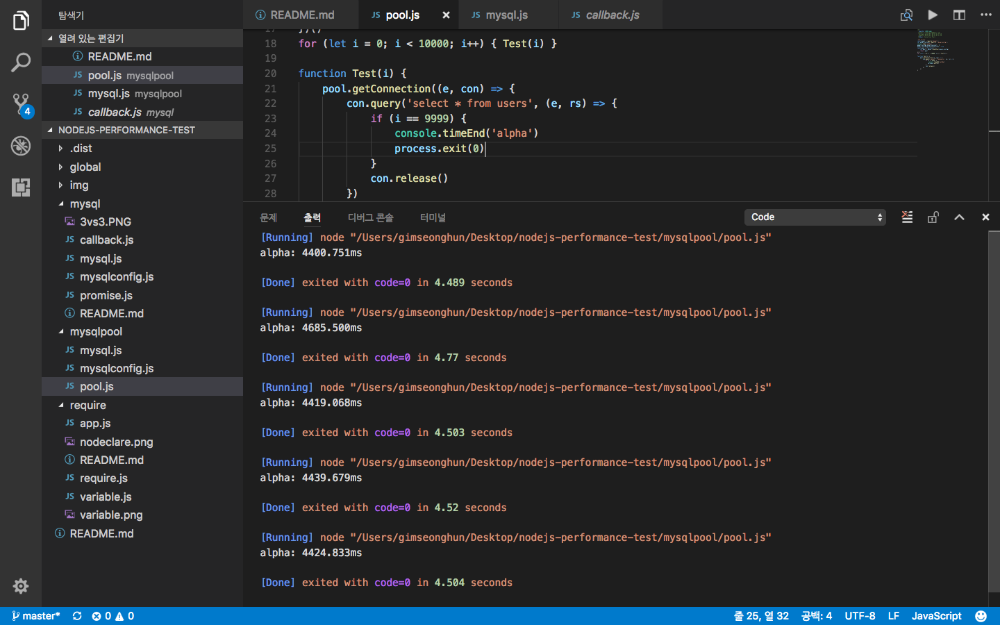

# 2017-08-24
mysql Connection Pool을 사용하고 안하고를 비교해봤다.. 
 VS  VS 

## Average
사용 안함 VS Pool사용 VS 계속 생성 
4406.2404ms VS 4473.9662ms VS ?? 
계속생성은 Too many Connections때문에 일단 귀찮아서 안했다. 
아무튼 엄청 느리다.

## Source Code
[mysql.js](mysql.js) 
[pool.js](pool.js) 
[create.js](create.js)