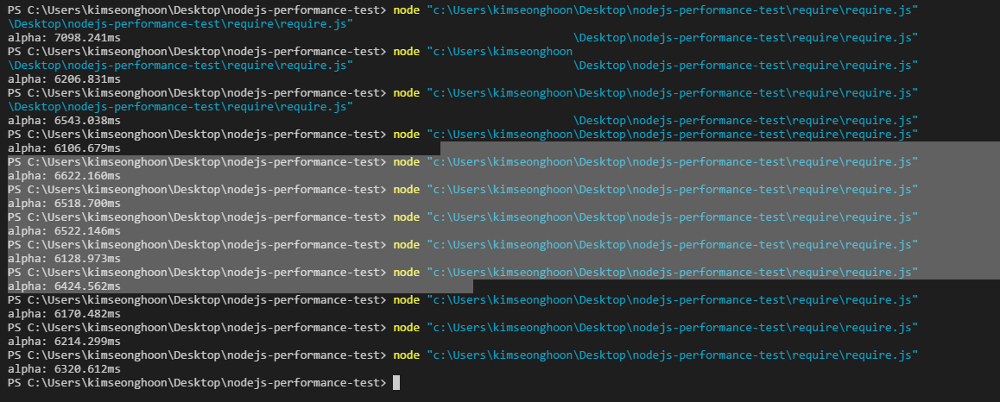

# 2018-03-28
코드의 문제점을 파악 후 변경함.

약 10 배정도 차이가 남
11948ms vs 984ms
# 2017-08-05
require를 변수로 선언해서 사용하고 안하고의 performance를 비교해봤다. 
 VS 

## Average
변수를 선언하지 않고 VS 선언하고 
6,988ms VS 21.9ms

## Source Code
[require.js](require.js) 
[variable.js](variable.js)
